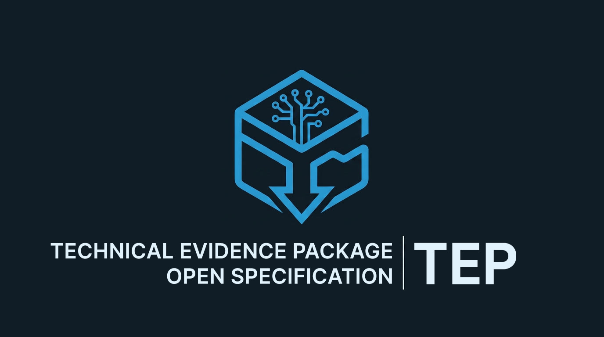



# Technical Evidence Package

**The open specification for the Technical Evidence Package (TEP) format and the Authorship Evidence Constitution.**

Any tool can produce a conformant TEP. LucidGrid is the reference implementation. This repository belongs to the format.

---

## What is this?

The US Copyright Office, the EU AI Act, and every major jurisdiction reviewing AI-generated creative work have arrived at the same requirement: copyright protection attaches to human creative decisions, not to the computational process that produced the output. The evidence of those decisions is what determines whether a studio can defend its IP.

The Technical Evidence Package defines:

1. **What counts as authorship evidence** for AI-assisted creative works.
2. **The format** in which that evidence is packaged for legal and compliance review.
3. **The detector schema** that maps AI platforms to detection mechanisms, indemnification status, and supported evidence tags — with a community registry for contributed tool entries.
4. **The schemas** that any conformant TEP producer must satisfy.
5. **Worked examples** that researchers, legal professionals, and pipeline supervisors can use directly.

---

## For whom

| Audience | Start here |
|---|---|
| Pipeline supervisors | [`docs/quickstart/FOR_PIPELINE_SUPERVISORS.md`](docs/quickstart/FOR_PIPELINE_SUPERVISORS.md) |
| Legal professionals | [`docs/quickstart/FOR_LEGAL_PROFESSIONALS.md`](docs/quickstart/FOR_LEGAL_PROFESSIONALS.md) |
| Researchers | [`docs/quickstart/FOR_RESEARCHERS.md`](docs/quickstart/FOR_RESEARCHERS.md) |
| Tool developers | [`docs/quickstart/FOR_TOOL_DEVELOPERS.md`](docs/quickstart/FOR_TOOL_DEVELOPERS.md) |

---

## The five-pillar architecture

The TEP format implements five architectural commitments that appear independently in other trusted evidence systems — double-entry accounting, forensic DNA paternity testing, and the Cisco Model Provenance Kit each implement the same structure at different layers.

**1. Constitution before tool.** The [`CONSTITUTION.md`](CONSTITUTION.md) precedes and governs the LucidGrid capture system. The tool implements the constitution.

**2. Multi-signal calibrated evidence.** Three evidence types, twelve HITL tags, paradigm classification, and an OpenTimestamps anchor are independent signals. No single signal is sufficient. Their combination, weighted by coverage, is the system's output.

**3. Tiered evidence pipeline.** Automated capture for ComfyUI. Browser session capture for other tools. HITL tag declaration for undocumentable actions. The cheap mechanism resolves most cases. The expensive mechanism handles the remainder. The signed declaration handles what neither can reach.

**4. External chain of custody.** Evidence stored separately from the artifacts it documents. OpenTimestamps anchor on the Bitcoin blockchain, separately from any platform infrastructure. IPTC XMP sidecar adjacent to the asset file. Three external records. None inside the artifact.

**5. Conservative defaults with named exclusions.** The eight exclusions in [`CONSTITUTION.md`](CONSTITUTION.md) Part V, the Tier 3 `open_weights` default for unrecognized ComfyUI checkpoints, the `human_attested` ceiling for auto-detection failures. A false positive in provenance carries immediate legal consequences. A false negative is recoverable. Default conservative.

---

## The TEP at a glance

A conformant TEP is a ZIP-compressed archive containing:

```
/MANIFEST.json                      — package index and integrity contract
/executive_summary.pdf              — human-readable compliance summary
/cryptographic_proof.json           — asset hashes + OpenTimestamps anchor
/attestation.json                   — project-level signed declaration
/indemnification_disclosure.json    — dual-status vendor terms record
/assets/{asset_uuid}/
    /metadata.json                  — per-asset HITL evidence record
    /screenshot.png                 — workspace capture (if captured)
    /xmp_sidecar.xmp                — IPTC XMP file-adjacent record
```

Current schema version: **v1.9.0**. Current capability level: **Level 1**.

Full format specification: [`spec/TEP_FORMAT.md`](spec/TEP_FORMAT.md).

---

## The tool detector registry

The [`registry/CONTRIBUTING_DETECTORS.md`](registry/CONTRIBUTING_DETECTORS.md) defines the schema and submission process for community-contributed tool detectors. It covers six categories — image, video, audio, 3D, local inference, and multimodal — and shows where community submissions are most needed.

LucidGrid is the reference implementation and maintains internal detection coverage across all categories. Community entries are tracked in [`registry/TOOL_REGISTRY.md`](registry/TOOL_REGISTRY.md).

Any tool that conforms to the detector JSON schema produces entries that are production-compatible with LucidGrid-generated TEPs.

---

## What this repository is not

This repository does not determine copyright ownership. It does not render legal opinions on AI-generated works. It defines what counts as evidence and how to package it. The legal conclusions from that evidence are for qualified counsel.

---

## VES alignment

The TEP vocabulary is designed to be legible to practitioners operating against the VES On-Set VFX Data Collection and Usage Guide. The `production_context` block follows Netflix VFX Shot/Version Naming. `fdl_link` URNs connect AI-generated framing declarations to physical production ASC FDL records. `omc_*` fields follow MovieLabs Ontology v2.8.

Full alignment table: [`spec/VES_VOCABULARY_ALIGNMENT.md`](spec/VES_VOCABULARY_ALIGNMENT.md).

---

## License

[CC BY 4.0](LICENSE). Any tool may implement the format. Attribution required. LucidGrid retains authorship of the specification documents.

---

*Maintained by LucidGrid Technologies — [lucidgrid.tech](https://lucidgrid.tech)*  
*Schema: v1.9.0 | Format: Level 1*
